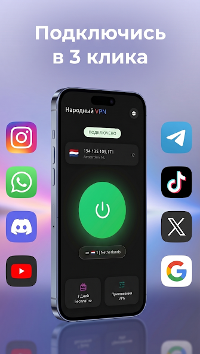
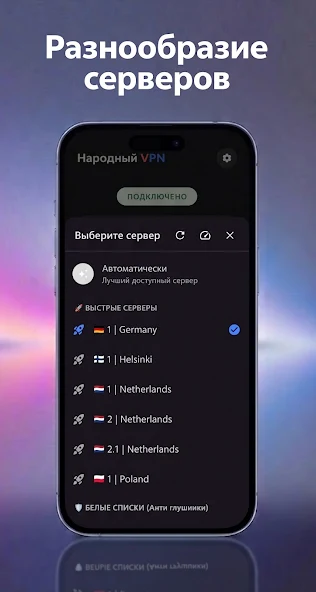
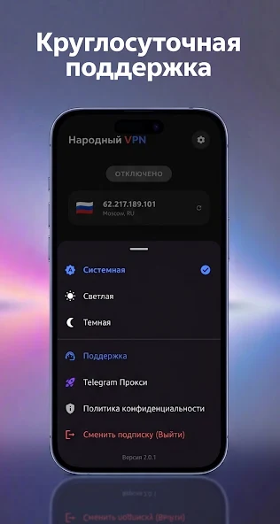

<div align="center">

# Народный VPN — Мобильный клиент

**Flutter-приложение для Android и Windows с поддержкой VLESS-протокола, шифрованием лицензий и раздельным туннелированием**


[](https://play.google.com/store/apps/details?id=online.narodniyvpn.app)

</div>

---

## О проекте

**Народный VPN** — production-клиент, написанный на **Flutter/Dart** с нуля: от онбординга до раздельного туннелирования. Работает на **Android 7+** и **Windows 10+**. Приложение интегрировано с собственным бэкендом через REST API, управляет VPN-соединением через нативные каналы (MethodChannel) и используется реальными пользователями как часть VPN-сервиса **narodniyvpn.online**.

Это мобильная часть системы. Десктопный Windows-клиент — в соседнем репозитории.

---

## Скриншоты

| Подключение в 3 клика | Выбор сервера | Настройки и поддержка |
|:---:|:---:|:---:|
|  |  |  |

---

## Возможности

### VLESS Config Generator
Полноценный парсер и генератор конфигов для **Xray-core** — написан вручную без сторонних библиотек. Разбирает VLESS URI и собирает готовый JSON-конфиг с нуля:

| Параметр | Поддерживаемые значения |
|---|---|
| Транспорт | TCP, WebSocket, gRPC |
| Безопасность | TLS (с fingerprint), XTLS Reality (publicKey, shortId, spiderX) |
| Flow | XTLS-Vision и другие |
| DNS | DoH (Cloudflare, Google) + fallback на localhost |

- **Smart MUX** — автоматически включается только для Cloudflare-нод (WS/gRPC), отключается при XTLS-flow, исключая краши при мультиплексировании
- **TCP Keepalive** — настроен на уровне `sockopt` для стабильной работы на мобильном LTE (пинг каждые 15 сек после 30 сек простоя)
- **Блокировка QUIC (UDP:443)** — предотвращает разрывы при просмотре YouTube и Instagram через Cloudflare

### Smart Subscription Manager
Умная система управления подписками с многоуровневым кэшированием:

- Кэш обновляется раз в час, принудительно сбрасывается при смене UUID ключа
- Обнаружение исчерпанного баланса через HTTP-коды (401/402/403/404) и пустой ответ сервера — совместимо с панелями **Marzban** и **3X-UI**
- Поддержка Base64-encoded конфигов и plain-text списков серверов
- Фоновое обновление без блокировки UI
- Нормализация URL: автозамена `http://` → `https://`, удаление устаревших портов и поддоменов

### Система активации и привязки к устройству
- Генерация уникального **Hardware ID** (Android ID / iOS Vendor Identifier)
- Активация лицензионного ключа через REST API с привязкой к конкретному девайсу
- Таймаут запроса 10 секунд, корректная обработка сетевых ошибок

### Шифрование лицензионных ключей
- Ключи распространяются в формате `narodniy://...` — строка, зашифрованная **AES-256-CBC**
- Ключ шифрования и IV задаются в локальном `lib/app_config.dart` (в репозиторий не попадает)
- При вставке ссылки — автоматическое определение типа и дешифровка

> Это клиентское приложение, поэтому ключ в любом случае попадает в собранный
> APK и извлекается из него. Шифрование ссылок здесь решает задачу обфускации,
> а не разграничения доступа — права проверяет сервер.

### Split Tunneling (раздельный трафик)
Экран управления маршрутизацией трафика по-приложению (Android):

- Загрузка списка всех установленных APK с иконками через MethodChannel
- Поиск по названию приложения в реальном времени
- Переключение «через VPN / напрямую» для каждого приложения
- Кнопка «Включить/Выключить всё»
- Настройки персистируются в `shared_preferences`

---

## Технический стек

| Компонент | Технология |
|---|---|
| Язык | Dart / Flutter 3 |
| Протокол | VLESS (Xray-core / V2Ray) |
| Шифрование | AES-256-CBC (`package:encrypt`) |
| Транспорты | WebSocket, gRPC, TCP (TLS / Reality) |
| HTTP-клиент | `package:http` |
| Хранилище | `shared_preferences` |
| Нативный мост | Flutter MethodChannel |
| Устройства | `device_info_plus`, `package_info_plus` |
| Платформы | Android 7+, Windows 10+ |

---

## Архитектура

```
lib/
├── main.dart                # Точка входа, роутинг, онбординг, переключение тем
├── activation_service.dart  # Получение HardwareID, активация ключа через API
├── security_service.dart    # AES-расшифровка narodniy://-ссылок
├── subscription_service.dart# Загрузка, парсинг и кэширование списка серверов
├── vless_parser.dart        # Парсер VLESS URI + генератор Xray JSON-конфига
└── split_tunnel_screen.dart # UI управления раздельным туннелированием
```

Плоская архитектура без лишних абстракций: вся бизнес-логика в сервисных классах со статическими методами. UI использует `StatefulWidget` + `setState` — достаточно для масштаба задачи.

**Поток подключения:**
1. Пользователь вводит ключ (`narodniy://...` или `vless://...` или URL подписки)
2. `SecurityService` расшифровывает ключ, `ActivationService` привязывает его к устройству
3. `SubscriptionService` загружает список VLESS-серверов, кэширует, обновляет в фоне
4. `VlessParser` парсит выбранный сервер и генерирует JSON-конфиг для Xray
5. Конфиг передаётся нативному коду через MethodChannel → запуск VPN-туннеля

---

## Сборка

### Конфигурация

Эндпоинты и ключ шифрования ссылок вынесены в локальный файл, которого нет в
репозитории. Перед первой сборкой создайте его из шаблона и подставьте свои
значения:

```bash
cp lib/app_config.example.dart lib/app_config.dart
```

### Android

```bash
flutter build apk --release
```

Нативные зависимости:

- `tun_fdwrap/` — враппер для работы с TUN-дескриптором на уровне ОС (в репозитории)
- `android/app/src/main/jniLibs/*/libtun2socks.so` — собранный движок туннелирования (в репозитории)

Пересобирать движок для работы над приложением не нужно — готовые `.so` уже
лежат в `jniLibs/`. Если всё же понадобится собрать его с нуля, исходники берутся
из upstream:

| Что | Откуда | Пин |
| --- | --- | --- |
| Go-движок tun2socks | [xjasonlyu/tun2socks](https://github.com/xjasonlyu/tun2socks) | `5c27ba32` |
| Android-обвязка | [LondonX/tun2socks-android](https://github.com/LondonX/tun2socks-android) | `33b00eba` |

### Windows

```bash
flutter build windows --release
```

---

## Связанные проекты в портфолио

| Проект | Описание |
|---|---|
| **Народный VPN — Windows Desktop** | Десктопный клиент (Electron + React + TypeScript), TUN-режим, split tunnel по 28 сервисам |
| **MegaBot — Telegram Autoposter** | Бот для автоматизации ведения каналов (Python, aiogram 3, SQLAlchemy, APScheduler) |

---

<div align="center">

Часть проекта **Народный VPN** · Мобильный и Windows-клиент на Flutter

</div>
